# 🎬 Movies List App — A Modern Flutter Application

A production-style movie browsing application built with Flutter, implementing clean architecture principles, Cubit state management, and efficient local persistence using Hive.

## 🚀 About The Project

Movies App allows users to explore popular, top-rated, and trending movies, search for specific titles, watch trailers, and manage their favorites locally.

This project focuses on:
- Clean architecture
- Smooth UI/UX
- Proper state management
- Performance optimization

---

## ✨ Features

- 🔥 Browse Popular, Top Rated & Trending movies
- 🔎 Search movies by name
- 🎥 Watch trailers directly on YouTube
- ❤️ Add & remove favorites (persistent storage using Hive)
- ⚡ Shimmer loading animations
- 🧠 State management using Cubit (Flutter Bloc)
- 🎨 Clean UI with Material 3
- 📱 Responsive design

---

## 🛠 Tech Stack

- Flutter
- Dart
- TMDB API
- Flutter Bloc (Cubit)
- Hive (Local Storage)
- URL Launcher
- Shimmer
- SVG Support

---

## 📂 Project Structure
lib/
├── models/
├── cubits/
├── services/
├── screens/
├── components/
├── helper/
├── screens/
├── shimmers/

---

## 📸 Screenshots

| Splash                                                 | Home                                                      |
| ------------------------------------------------------ | --------------------------------------------------------- |
|                | 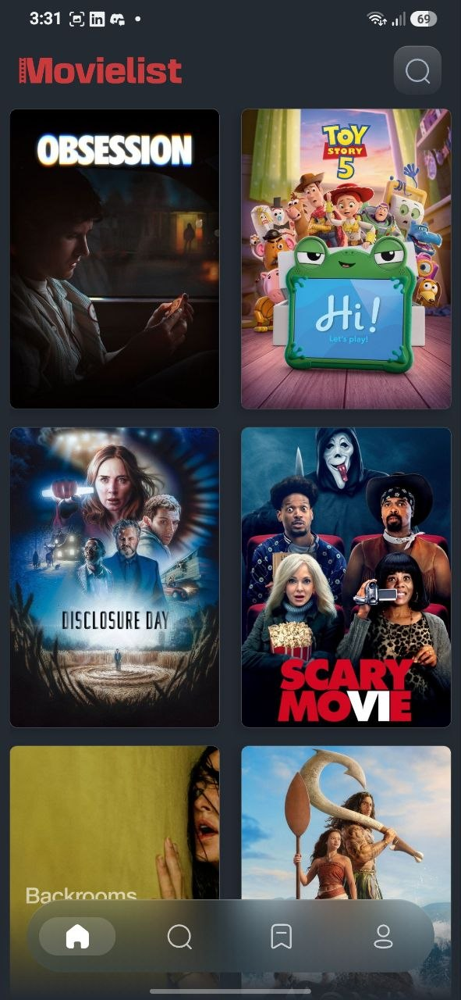                      |

| discover                                               | search                                                    |
| ------------------------------------------------------ | --------------------------------------------------------- |
| 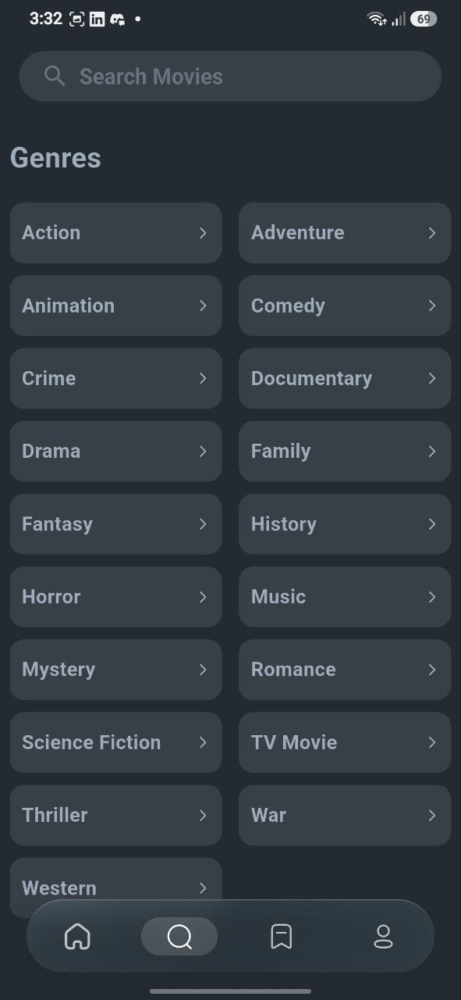           | 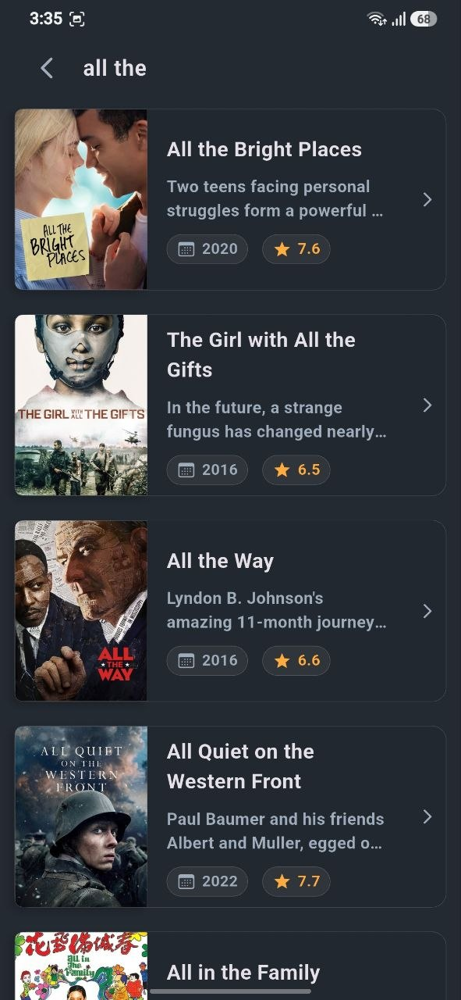                  |

| favourite                                              | favourite(2)                                              |
| ------------------------------------------------------ | --------------------------------------------------------- |
| 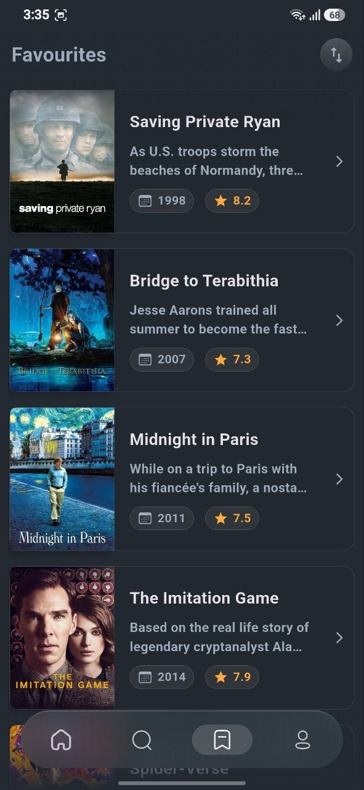         | 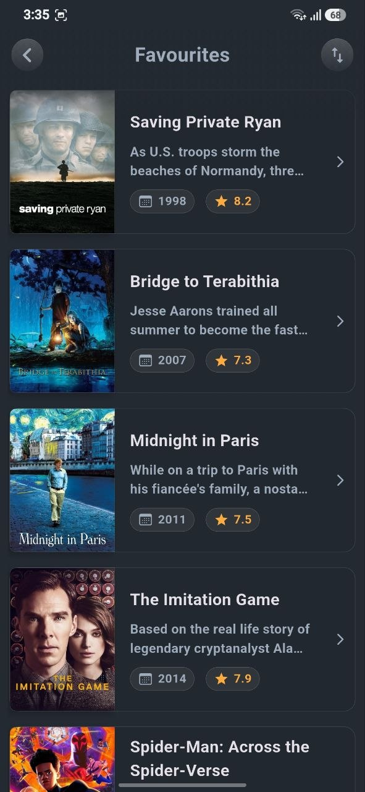          |

| profile                                                | movie details                                             |
| ------------------------------------------------------ | --------------------------------------------------------- |
| 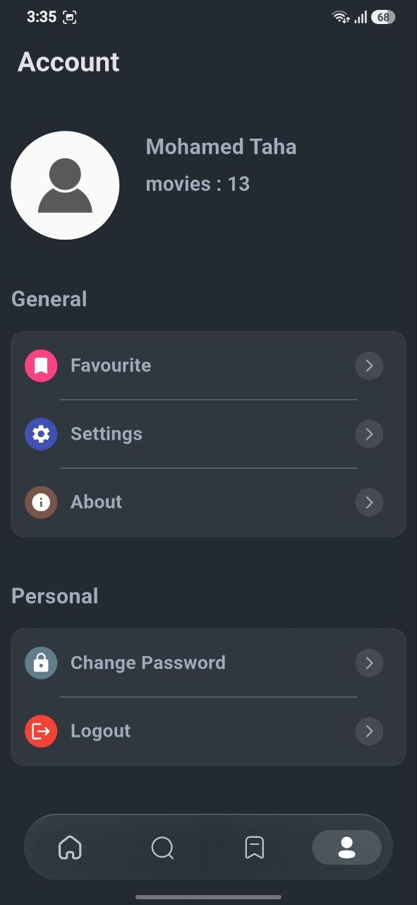             | 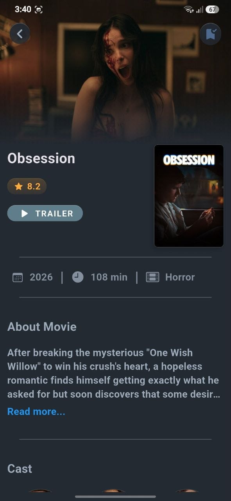         |

| movie details (2)                                      | actor                                                     |
| ------------------------------------------------------ | --------------------------------------------------------- |
| 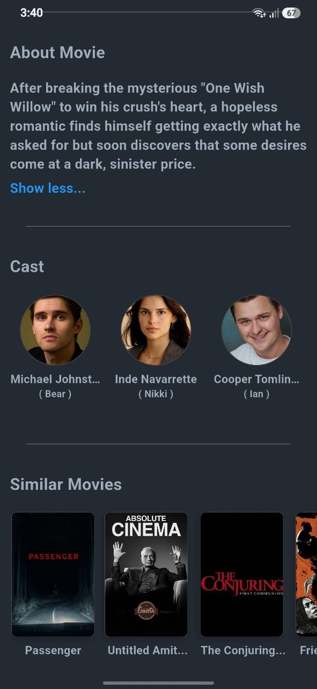      |                    |

| actor (2)                                              | favourite(3)                                              |
| ------------------------------------------------------ | --------------------------------------------------------- |
| 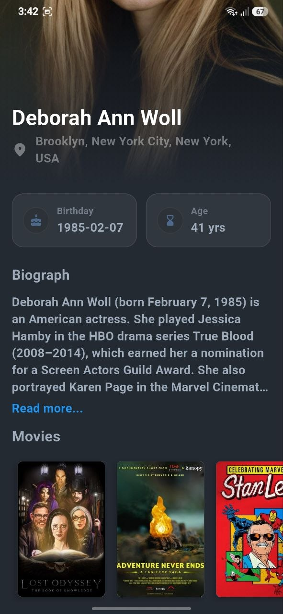                | 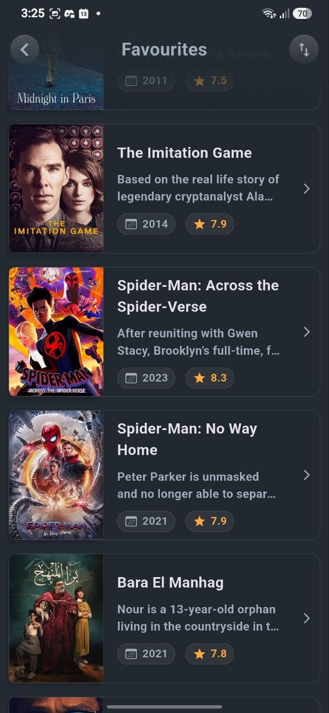          |

| favourite(4)                                           | category                                                  |
| ------------------------------------------------------ | --------------------------------------------------------- |
| 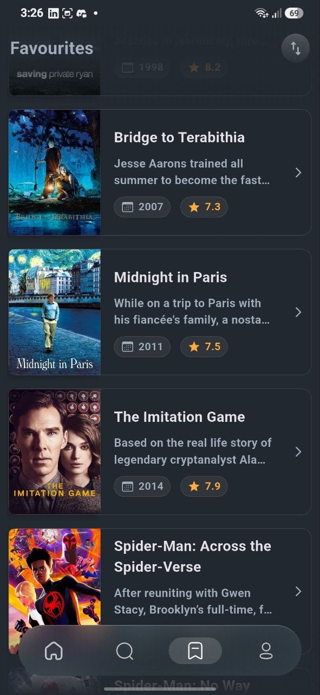        | 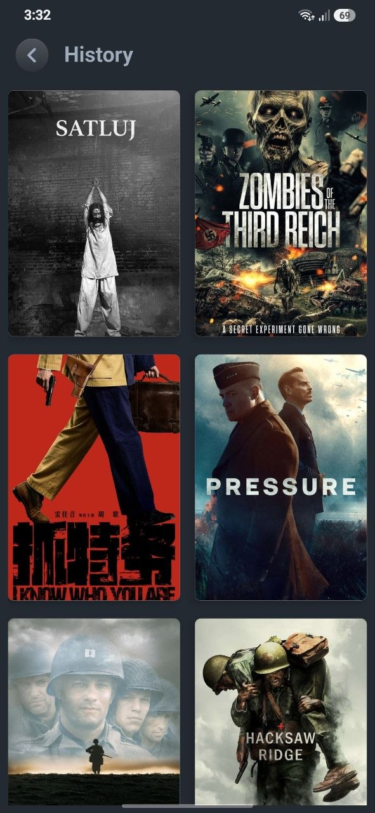             |

---

## 📚 What I Learned

- REST API integration & async handling
- State management using Cubit
- Local persistence with Hive
- Clean folder structure organization
- Improving UI polish with Shimmer effects
- Handling navigation & deep linking to external apps

---

## 🔗 Live Demo

---

## 👨‍💻 Developed By

**Mohamed Taha**  
Flutter Developer  
